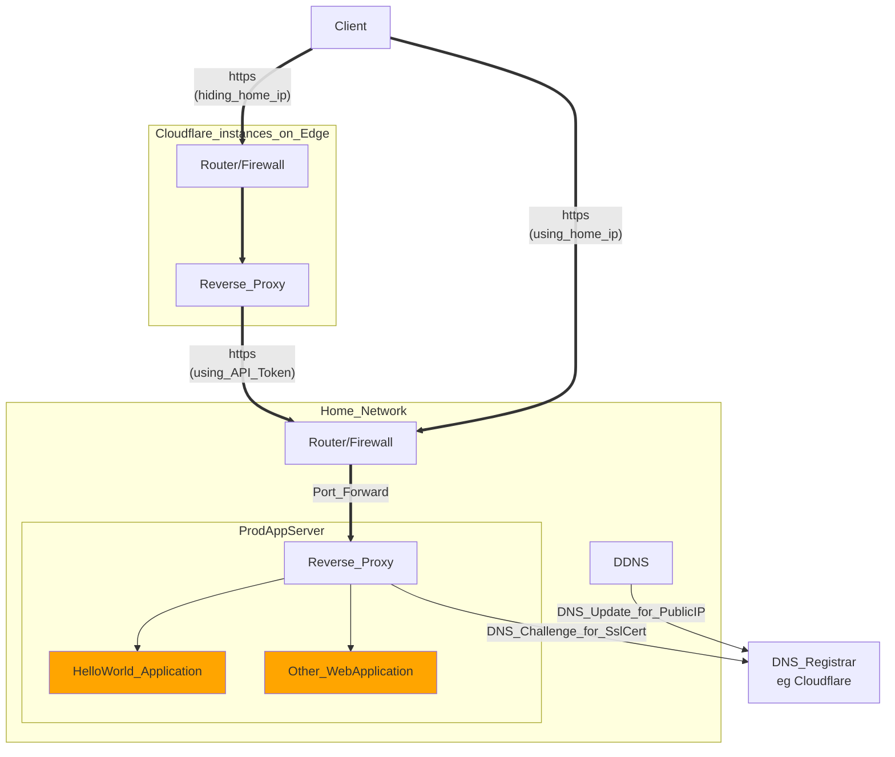

```mermaid
%% Architecture of HelloWorld application
graph TB;

CL[Client]
subgraph CF[Cloudflare_instances_on_Edge ]
    CF_RF[Router/Firewall] 
    CF_RP[Reverse_Proxy]
    CF_RF ==> CF_RP
end
subgraph HN[Home_Network]
    HN_RF[Router/Firewall]
    HN_DD[DDNS]
    subgraph PS[ProdAppServer]
        PS_RP[Reverse_Proxy]
        PS_PA1[HelloWorld_Application]
        style PS_PA1 fill:orange
        PS_PA2[Other_WebApplication]
        style PS_PA2 fill:orange
        PS_RP --> PS_PA1
        PS_RP --> PS_PA2
    end
    HN_RF ==Port_Forward==> PS_RP
end
CL ==https <br> (hiding_home_ip)==> CF_RF
CF_RP == https <br> (using_API_Token)==> HN_RF
CF_DR[DNS_Registrar <br> eg Cloudflare] 
CL == https <br> (using_home_ip) ==> HN_RF
HN_DD --DNS_Update_for_PublicIP--> CF_DR
PS_RP --DNS_Challenge_for_SslCert--> CF_DR

```
